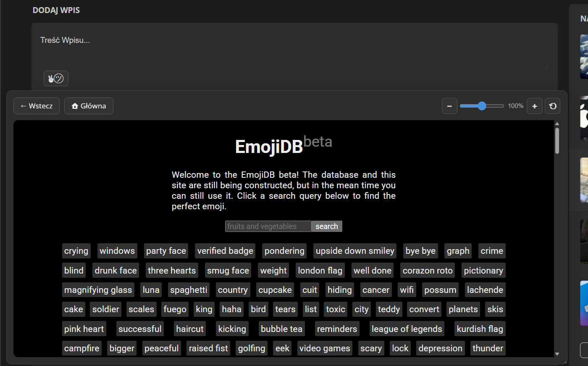

# Wykop EmojiDB (iframe)

Skrypt do rozszerzenia **Tampermonkey**, który dodaje mały, ale potężny przycisk przy polu tekstowym na Wykop.pl. Po kliknięciu otwiera się podręczny panel z stroną emojidb.org.

To prawdziwy **QOL must-have** dla każdego, kto lubi rzucać emotkami w komentarzach i wpisach.

## Główne funkcje:
* **Baza emotek pod ręką:** Dodaje przycisk (`✌︎㋡`) obok każdego pola tekstowego na Wykopie. Jego kliknięcie wysuwa panel z wyszukiwarką emotek emojidb.org.
* **Wygodna nawigacja (iframe):** Skrypt wymusza na stronie EmojiDB otwieranie linków wewnątrz okienka (zamiast w nowych kartach). Dodatkowe przyciski "Wstecz" i "Główna" ułatwiają skakanie po kategoriach. Po wybraniu emoji wystarczy kliknąć na nie, a wybrana emotka skopiuje się do schowka.
* **Pamięć sesji i rozmiaru:** Możesz dowolnie rozciągać i powiększać panel z emotkami. Skrypt zapamięta Twoje preferencje i przy kolejnym otwarciu okienko będzie miało dokładnie taki sam rozmiar.

## Rekomendowany wygląd:
Bardzo polecam, gdyż skrypt najlepiej wygląda w połączeniu ze zmienionym interfejsem. 
Osobiście używam go razem z rozszerzeniem **Stylus** oraz stylem:  
**[Wykop X / The Best Style](https://github.com/tentin-quarantino/wykop-the-best-style)**

> Skrypt działa też bez dodatkowego stylu, ale z „Wykop X” prezentuje się najlepiej.

## Instalacja:

1. Zainstaluj darmowe rozszerzenie **Tampermonkey** dla swojej przeglądarki:  
   [Chrome](https://chrome.google.com/webstore/detail/tampermonkey/dhdgffkkebhmkfjojejmpbldmpobfkfo) / [Firefox](https://addons.mozilla.org/pl/firefox/addon/tampermonkey/) / [Edge](https://microsoftedge.microsoft.com/addons/detail/tampermonkey/iikmkjmpaadaobahmlepeloendndfphd).

2. Kliknij w poniższy link, aby zainstalować skrypt:

**[ZAINSTALUJ SKRYPT](https://github.com/Black-Reven/Wykop-EmojiDB-iframe/raw/main/WykopEmojiDB.user.js)**

**[ZAINSTALUJ PRZEZ GREASY FORK](https://greasyfork.org/pl/scripts/571967-wykop-emojidb-iframe)** 

## WAŻNE!!!
Chciałbym zaznaczyć, że **nie jestem programistą**, a samo programowanie to dla mnie czarna magia.  
Skrypt powstał z potrzeby oraz wizji, którą udało się przekształcić w działający kod przy wsparciu różnych AI.

Zależy mi na tym, aby to narzędzie było jak najlepsze dla wszystkich użytkowników Wykopu. Jeśli zauważysz w kodzie błędy, braki lub masz pomysł na optymalizację to **bardzo proszę o ich wypunktowanie**. Będę wdzięczny za każdą pomoc, a jeszcze bardziej za gotowe edycje kodu wraz z poprawkami!
